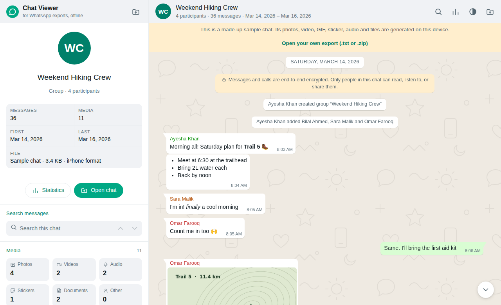
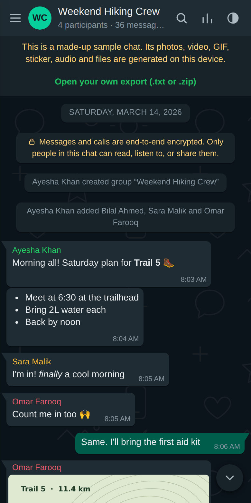
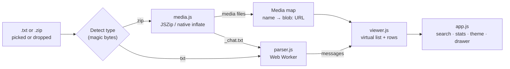

# WhatsApp Chat Viewer

[](https://github.com/chuzair598337/whatsapp-chat-viewer/actions/workflows/deploy-pages.yml)

**Live app:** https://chuzair598337.github.io/whatsapp-chat-viewer/

Read your exported WhatsApp chats in a familiar, WhatsApp-style interface, with photos, videos, voice notes, documents, search and statistics. The chat is processed **entirely in your browser**: nothing is uploaded, and the page makes no network requests once it has loaded.

| Desktop (light) | Phone (dark) |
|---|---|
|  |  |

*The screenshots show the built-in sample chat. Its people and media are made up.*

## Highlights

- Opens a plain `.txt` export or a full `.zip` export with media, or several chats at once with a chat list to switch between them.
- Reads iPhone and Android formats, 12-hour and 24-hour times, and day/month or month/day dates, detected automatically.
- Shows photos (with a zoomable viewer), stickers, GIFs, videos (including portrait), voice notes with waveforms, audio files, PDFs with page previews, documents, contact cards and link cards.
- Marks messages WhatsApp leaves out of exports, such as events, instead of hiding them.
- Search with highlighting and match navigation (`/` to start), date-range and sender filters, jump-to-date and jump-to-bottom.
- Star messages to collect them in a side panel while you read (never saved).
- Group chats show coloured names and initials avatars, and reaction lines become reaction pills.
- A statistics window with message counts, top senders and activity charts.
- Light, dark and system themes, and a responsive layout for desktop and phone.
- A start screen for picking a chat, plus a sample chat with a guided tour of every feature. **Help and guided tour** in the ⋮ menu brings the tour back.
- Handles chats of 50,000+ messages smoothly.

The full feature list is in **[docs/features.md](docs/features.md)**, and release notes are in **[CHANGELOG.md](CHANGELOG.md)**.

## Architecture



- **Static site:** plain HTML, CSS and JavaScript with no build step and no server code.
- **Two dependencies, both vendored in `js/vendor/`:** JSZip, and pdf.js for PDF previews, which is only loaded when a chat has a PDF.
- **Parsing and unzipping:** run in Web Workers created from inline Blob URLs, so large chats don't freeze the page.
- **Media:** stays in memory as `blob:` URLs, which are revoked when another chat is opened.
- **Rendering:** only the rows on screen exist in the DOM. A Fenwick tree tracks row heights for fast scrolling.

```
whatsapp-chat-viewer/
├── .github/workflows/deploy-pages.yml   # deploys main to GitHub Pages
├── docs/
│   ├── features.md                       # full feature documentation
│   └── images/                           # README screenshots
├── index.html                            # page markup
├── css/styles.css                        # styles and light/dark theme tokens
├── js/
│   ├── vendor/jszip.min.js               # JSZip 3.10.1 (MIT)
│   ├── vendor/pdfjs/                     # pdf.js 3.11.174 (Apache-2.0), loaded on demand
│   ├── parser.js                         # chat parser and worker setup
│   ├── media.js                          # ZIP reading, media map, audio controller
│   ├── text-truncator.js                 # Read more / Show less for long messages
│   ├── viewer.js                         # formatting, virtual list, media players
│   ├── demo-data.js                      # made-up sample chat and its generated media
│   ├── app.js                            # file loading, search, stats, theme, boot
│   └── tour-controller.js                # welcome dialog and guided tour
├── .claude/skills/                       # agent guides: parser, virtual scroll, media
├── CHANGELOG.md                          # release notes
├── CLAUDE.md                             # short pointer for coding agents
├── PROJECT_RULES.md                      # rules for every change (privacy, both export types, performance, a11y)
├── todo.md                               # work list by priority
├── deferred.md                           # out of scope, and why
├── .gitignore
└── README.md
```

## Usage

### 1. Export a chat from WhatsApp

| | iPhone | Android |
|---|---|---|
| Open | the chat, then tap the contact or group name | the chat, then tap **⋮ › More** |
| Choose | **Export Chat** | **Export chat** |
| Pick | **Attach Media** (photos, videos, voice notes) or **Without Media** (text only) | **Include media** or **Without media** |
| Save | the `.zip` to Files, or send it to your computer | the `.zip` or `.txt` to your device or computer |

### 2. Open it in the viewer

1. Go to the [live app](https://chuzair598337.github.io/whatsapp-chat-viewer/).
2. On the start screen, drag the `.zip` or `.txt` file onto the page or click **Browse files**. You don't need to unzip it first. To look around first, choose **Try the sample chat**.
3. Pick which participant is you, so your messages show on the right.

To use the viewer with no internet connection, download the repository and open `index.html` straight from disk.

### What WhatsApp exports leave out

The viewer can only show what's in the export file. WhatsApp leaves out:
- **Reactions.** If your export does contain `reacted … to "…"` lines, the viewer shows them as reaction pills.
- **Replies:** which earlier message a reply was answering.
- **Events:** the export has an empty line in their place, and the viewer marks it.
- **View-once media.**
- **Media** you chose not to include when exporting.

## Local development

You don't need to install anything. Clone the repository and either open `index.html` directly or serve the folder:

```bash
git clone https://github.com/chuzair598337/whatsapp-chat-viewer.git
cd whatsapp-chat-viewer
git checkout development

python3 -m http.server 8000      # or: npx serve .
# then open http://localhost:8000
```

Notes:
- The scripts are classic `<script>` files that share globals, loaded in order: `jszip` → `parser` → `media` → `text-truncator` → `viewer` → `demo-data` → `app` → `tour-controller`. Keep that order when adding files.
- Keep the app offline. Don't add CDN links, web fonts, analytics or anything that fetches at runtime. Vendor any library into `js/vendor/`.
- Test chats are ignored by `.gitignore` (`*.zip`, `*.txt`). Never commit a real chat export.

## Branching and contributions

Read [PROJECT_RULES.md](PROJECT_RULES.md) first. Planned work is in [todo.md](todo.md), and ideas that were ruled out are in [deferred.md](deferred.md).

| Branch | Purpose |
|---|---|
| `main` | Production. Every push deploys to GitHub Pages. |
| `development` | Default branch for day-to-day work, where features and fixes are integrated. |

Workflow:

1. Branch from `development`, for example `feature/voice-speed` or `fix/android-dates`.
2. Open a pull request into `development`. Check the viewer by hand with a `.txt` and a `.zip` export, in light and dark mode, and at phone width.
3. When `development` is ready to release, open a pull request from **`development` → `main`**.
4. Merging into `main` runs the **Deploy to GitHub Pages** workflow, and the live site updates a minute or two later.

## License

The viewer's code is provided as-is by its author. JSZip is used under the MIT license (see the header of `js/vendor/jszip.min.js`), and pdf.js under the Apache License 2.0 (`js/vendor/pdfjs/LICENSE`).
